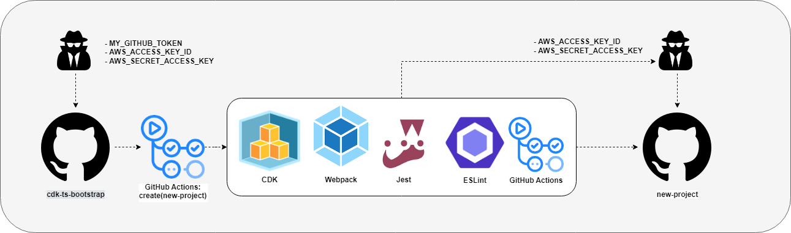

# **AWS CDK TypeScript Bootstrap**

## **Description:**

    This repository can be used to bootstrap a new AWS CDK TypeScript project on GitHub.
    Bootstrapped project will contain: 
        * Jest for unit testing.
        * ESLint for static code analysis.
        * Webpack for compression.
        * GitHub Action CI/CD workflows for deploying to the AWS Cloud.

### **Overview:**

    

### **Prerequisites:**

In order to use this project you will need:

* a GitHub Organisation Account
* a GitHub Personal access tokens
* an AWS Account
* AWS Programmatic access:
  * AWS_ACCESS_KEY_ID
  * AWS_SECRET_ACCESS_KEY

### **Usage:**

* Fork this repository to your own GitHub organisation.
* Save your GitHub Personal access tokens in the secrets of the forked repository.
* Save your AWS acces key and secret acces key in the secrets  of the forked repository.
* Change the value for OWNER to your GitHub organisation in ./setup/index.ts.
* Run the create workflow by entering new project name.

### **Useful commands:**

| Command  | Description    |
|----------|----------------|
|`npm run build`|compile typescript to js|
|`npm run test`|perform the jest unit tests|
|`npm run lint`|perform static analyses on code|
|`cdk bootstrap`|bootstrap aws for cdk on first time using cdk|
|`cdk diff`|compare deployed stack with current state|
|`cdk synth`|emits the synthesized CloudFormation template|
|`cdk deploy`| deploy this stack to your default AWS account/region|
